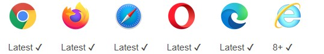

# 安装与介绍

## 1. 安装

```bash
npm install axios -D
```

## 2. 介绍

### 2.1 兼容性



### 2.2 适用平台

- Web 端以及 Web 端应用
- Node.js

### 2.3 特点

1. 支持 node 和浏览器
2. 基于 promise 语法进行编写，支持 Promise API
3. 从浏览器中创建 [XMLHttpRequests](https://developer.mozilla.org/en-US/docs/Web/API/XMLHttpRequest)
4. 拦截请求和响应
5. 转换请求数据和响应数据
6. 取消请求
7. 自动转换 JSON 数据
8. 客户端支持防御 [XSRF](http://en.wikipedia.org/wiki/Cross-site_request_forgery)

### 2.4 生态环境

[axios 生态环境](https://github.com/axios/axios/blob/master/ECOSYSTEM.md)
