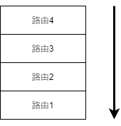
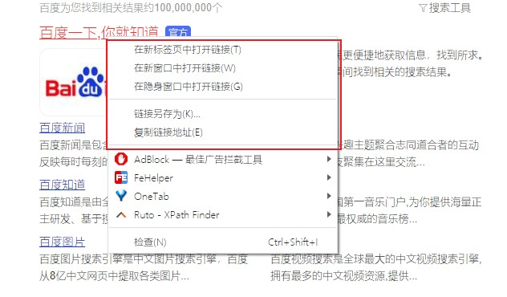

# 路由控制

## 一、路由跳转

### 1. 网站内跳转

#### (1) vm.$router

vm.$router有最常用的四种方法：

- push 跳转到某个路由，最常用。
- replace 调换当前页面的路由，无刷新。
- resolve 解析路由并跳转，适用于新开tab跳转等行为
- go 在历史记录前进或者后退。

使用这几个方法之前，要先理解路由的存储，对于一个网站路由记录的存储，其数据结构为栈，如下：



```js
# push: 向栈顶推入一条路由信息（使用name表示路由）
this.$router.push({
    name:"Page1"
});

# push:向栈顶推入一条路由信息（使用path表示路由）
this.$router.push({
    path:"/page/page1"
});

# push: 向栈顶推入一条路由信息（直接传入字符串表path）
this.$router.push("/page/page1");


# replace：将栈顶的一条路由信息替换为新信息(类push可以传入对象，也可以传入字符串)
this.$router.replace({
    name:"Page1"
});

# resolve：解析路由
const {href} = this.$router.resolve({name:"Page1"});
window.open(href, "_blank");

# go：当前路由信息为0，以当前路由为基准，向下-1, 向上+1
# 后退一步
this.$router.go(-1)
```

#### (2)router-link

`router-link`和`router`使用方法相同，如下：

```vue
<router-link :to="{name:"Page1"}"></router-link>
```

- router-link实际渲染了一个a标签。其具有以下功能：



- 传参

```vue
//	类似this.$router

//	对象
<router-link :to="{ name: 'Page1', query: { name: 'mmmmm' }, params: { id: 123 } }">链接1</router-link>

//	字符串
<router-link to="/page/page1">链接1</router-link>
```

### 2. 网站外跳转

> 直接使用JavaScript原生方法

```js
window.location.href = "https//www.baidu.com"
```

```html
<a href="https://www.baidu.com"></a>
```

## 二、传参

### 1. 路由传参

#### (1)rest参数

需要在路由定义时声明，否则传递无效。

```js
{
    path: "/page1/:id",
    name: "Page1",
    component: () => import("../views/Page1.vue"),
},
```

通过以下方式可以传递参数。

```js
this.$router.push({
    name:"Page1",
    params:{
        id:"123"
    }
})
```

通过`this.$route.params`访问。

此时，id必传，如果不传递id，则页面将加载不出来。

如果一个参数可传可不穿，那么可以在参数末尾加上`?`表示可传可不传。即：`/page1/:id?`。此时，页面可正常加载。

#### (2)query参数

query参数无需此前定义，直接传递。

```js
this.$router.push({
    name:"Page1",
    query:{
        id:"123",
        name:"m"
    }
})
```

#### (3)直接字符串传参

注意，`router`的方法除了可以是对象，还可以是字符串，在字符串中也是可以直接传参的。如下：

```js
//	params传参
this.$router.push("/page1/1");

//	query传参
this.$router.push("/page?id=123&name=m")
```

#### (4)props

如果不想每次都使用`this.$route.params`一长串去取出params参数，可以使用props方法。这种方式也有其问题，与父组件的传值混合在一起，数据源不明，建议使用这种方式，一定要加上注释，以方便维护。

##### A：使用true

> 这种方式默认只解构params参数

```js

{
    path: "page1/:id",
    name: "Page1",
    component: () => import("../views/Page1.vue"),
    props: true,
  },
      
//	使用的页面
props: {
    //	路由prop
    id: {
      type: String,
      default: "",
    },
},

//	直接使用
{{id}}
```

遇上命名路由，必须声明你的参数在哪个路由视图可取。

```js
// 对于包含命名视图的路由，你必须分别为每个命名视图添加 `props` 选项：
{
  path: '/user/:id',
  components: { default: User, sidebar: Sidebar },
  props: { default: true, sidebar: false }
}
```

###### B：使用函数

> 这种方式可以同时取出query和params值

```js
{
    path: "page1/:id",
    name: "Page1",
    component: () => import("../views/Page1.vue"),
    props: (route) => ({ name: route.query.name, id: route.params.id }),
},

 //	使用页面
props: {
//  路由props
id: {
  type: String,
  default: "",
},
//  路由props
name: {
     type: String,
      default: "",
    },
},
```

### 2. 路由视图传参

`router-view`本质是`slot`，其表现形式为组件，所以在`router-view`上我们可以类似组件的props传值。