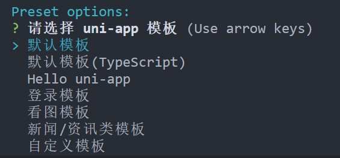

# 使用 Vue-CLI 创建项目

## 1. 创建一个默认项目

1. 基于远程的`dcloudio/uni-preset-vue`在当前目录下创建项目

```bash
vue create -p dcloudio/uni-preset-vue .
```

2. 等待模板从远程拉取之后，会出现 uni-app 模板选择，这里，我们选择默认模板即可。



## 2. 组织项目目录

> 项目目录组织如下（默认项目没有就新建，看需要建立）

```text
|-- public
	|-- index.html // 入口页面
|-- src
	|-- apis // api接口
		|-- project.api.js // 项目api接口
		|-- ...
	|-- plugins // 插件
		|-- http.plugin.js // http请求工具
		|-- ...
	|-- components // 全局组件
		|-- Dialog  // 对话框全局组件
			|-- Dialog.vue // 全局组件代码
            |-- README.md // 组件说明文档
            |-- example.gif // 演示图片
        |-- ...
	|-- filters // 全局过滤器
		|- KSep.filter.js // 千分符分隔过滤器
		|- ...
	|-- directives // 全局指令
		|-- title.directive.js // 标题指令
	|-- router // 路由管理
		|-- index.js
	|-- store // 全局存储
		|-- index.js
	|-- pages // 页面
	|-- static // 静态资源，图片等资源必须放这里
		|-- img // 图片资源
		|-- css // 通用css文件
		|-- lib // 库资源
	|-- App.vue // 入口页面
	|-- main.js // 入口文件
	|-- mainfest.json // 项目配置
	|-- pages.json // 页面配置
	|-- uni.scss // 全局样式
	|-- autoRegister.js  // 自动注册工具
|-- pacakge.json
```

## 3. 运行项目

```bash
# 默认在web端上运行(h5)
npm run serve

# 指定某个平台运行
npm run dev: %PLATFORM%
```

PLATFORM 的值如下：

> 实际支持的比列表更多，详情请查看项目根目录下的`package.json`文件中的`scripts`脚本。

| 值         | 平台         |
| :--------- | :----------- |
| h5         | H5           |
| mp-alipay  | 支付宝小程序 |
| mp-baidu   | 百度小程序   |
| mp-weixin  | 微信小程序   |
| mp-toutiao | 头条小程序   |
| mp-qq      | qq 小程序    |

如果是小程序端，执行`npm run dev`之后，会在项目目录的`/dist/dev/`文件夹下生成对应的打包文件。
