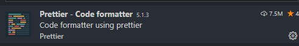

## 前端开发流程及规范

## 开发前软件准备

### 软件

- [Vscode](https://code.visualstudio.com/Download)

  > 安装好 Vscode 之后，随便选择一个项目，查看右键快捷方式中，是否有`通过 Code 打开`字样。若无，请参照以下链接进行添加 [右键添加通过 Vscode 打开快捷方式](#右键添加通过Vscode打开快捷方式)

- [Node.js](https://nodejs.org/zh-cn/download/)

  - 具体安装教程可以参照 [Node.js 安装配置](https://www.runoob.com/nodejs/nodejs-install-setup.html)

  ::: warning 注意
  安装完成之后一定要检查，`Node.js`以及其对应的`npm`版本是否正确。具体参考 [node 以及对应的版本](https://nodejs.org/zh-cn/download/releases/)
  :::

- [SourceTree](https://www.sourcetreeapp.com/)

### VsCode 设置

- 去掉默认勾选的`控制活动代码段是否阻止快速建议`，

  > 提示 html 标签、style 样式、css 属性及值

#### VsCode 扩展

##### 核心

> 通过安装扩展我们可以增强 VsCode 编辑器的功能，加快开发的效率

- Chinese (Simplified) Language Pack for Visual Studio Code

  > 将 VsCode 汉化成中文

  

- vscode-fileheader-git

  > 自动生成和更新文件头注释

  

- Auto Close Tag

  > 自动为当前的起始标签生成一个结束标签

  

- Path Intellisense

  > 自动识别路径

  

- Auto Rename Tag

  > 更改标签时，将对应的开始/结束标签随之变动

  

- JavaScript (ES6) code snippets

  > 提示 ES6 语言。需要记住的常用快捷提示`thenc`

  

* GitLens

  > 在编辑器中提示代码的最近修改记录（如果 Git 的版本过于落后，可能会导致其无法很使用。注意看 VsCode 的提示）

  

* quick-vue-template

  > 生成 vue 模板、api 文件、mock 服务、路由文件、vuex 模板

  

- Vetur

  > 高亮 vue 语法、vue 语法提示、监测、格式化、自动完成及调试

  

* Prettier - Code formatter

  > 代码格式化

  

* Eslint

  > js 代码监测工具

  

- Ant Design Vue helper

  > ant-design-vue 标签提示

  

- Vant Snippets

  > vant 的提示

  

- minapp

  > 小程序语法提示

  

##### 可选

- One Dark Pro

  > 暗色系的编辑器主题

  

- SVG Viewer

  > SVG 图片查看器

  

#### 设置`setting.json`

> 安装完 vscode 扩展之后，需要在 vscode 中配置如下：使得`vetur/prettier/eslint`生效

```js
{
  "terminal.integrated.rendererType": "dom",
  "editor.fontSize": 24,
  "editor.wordWrap": "on",
  "workbench.iconTheme": "eq-material-theme-icons-ocean",
  "search.followSymlinks": false,
  "git.autofetch": true,
  "vetur.format.defaultFormatter.html": "js-beautify-html",
  "prettier.jsxSingleQuote": true,
  "editor.tabSize": 2,
  "eslint.validate": [
    "javascript",
    "javascriptreact",
    "html",
    "vue",
    {
      "language": "html",
      "autoFix": true
    },
    {
      "language": "vue",
      "autoFix": true
    },
    {
      "language": "typescript",
      "autoFix": true
    },
    {
      "language": "typescriptreact",
      "autoFix": true
    }
  ],
  "eslint.options": {
    "extensions": [".html", ".js", ".vue"]
  },
  "eslint.run": "onSave",
  "vetur.format.defaultFormatterOptions": {
    "js-beautify-html": {
      "wrap_attributes": "force"
    },
    "prettyhtml": {
      "printWidth": 100,
      "singleQuote": false,
      "wrapAttributes": false,
      "sortAttributes": false
    }
  },
  "prettier.printWidth": 120,
  "editor.formatOnPaste": true,
  "editor.formatOnSave": true,
  "editor.formatOnType": false,
  "workbench.colorTheme": "One Dark Pro",
  "files.autoSave": "off",
  "window.zoomLevel": 0,
  "editor.suggestSelection": "first",
  "vsintellicode.modify.editor.suggestSelection": "automaticallyOverrodeDefaultValue",
  "[javascript]": {
    "editor.defaultFormatter": "esbenp.prettier-vscode"
  },
  "files.associations": {
    "*.cjson": "jsonc",
    "*.wxss": "css",
    "*.wxs": "javascript"
  },
  "emmet.includeLanguages": {
    "wxml": "html"
  },
  "minapp-vscode.disableAutoConfig": true,
  "javascript.updateImportsOnFileMove.enabled": "always",
  "[wxml]": {
    "editor.defaultFormatter": "qiu8310.minapp-vscode"
  },
  "debug.console.fontSize": 24,
  "markdown.preview.fontSize": 24,
  "terminal.integrated.fontSize": 24,
  "[html]": {
    "editor.defaultFormatter": "esbenp.prettier-vscode"
  },
  "[json]": {
    "editor.defaultFormatter": "vscode.json-language-features"
  },
  "editor.codeActionsOnSave": {
    "source.fixAll.eslint": true,
    "source.fixAll": true
  },
  "[vue]": {
    "editor.defaultFormatter": "esbenp.prettier-vscode"
  },
  "editor.quickSuggestions": {
    "strings": true
  },
  "editor.renderControlCharacters": true,
  "emmet.triggerExpansionOnTab": true,
  "editor.suggest.snippetsPreventQuickSuggestions": false
}
```

## 工作量评估

> 适用于个人和小型团队

[模板查看](./工作量评估)

## 技术选型

- web 端： vue+ vue-router+vuex+axios+ ant-design-vue+Ant G2...

- 移动端： vue+vue-router-vuex+axios+vant

## 开发规范

> 采用 Airbnb 开发规范

- [css&sass 开发规范](https://www.bookstack.cn/read/AirbnbCSSSassCN/README.md)
- [Javascript 开发规范](https://www.bookstack.cn/read/AirbnbJavaScriptStyleCN/README.md)
- [vue 开发规范](https://doc.vue-js.com/v2/style-guide/)

## Git 提交规范

### 分支管理规范

#### 分支结构管理

结构如下：

```text
|-- 1.0  // 以下均为版本开发分支
	|-- xiaoli.wang
	|-- xiaoer.wang
	|-- dev // 版本开发主分支
|-- 1.1
	|-- xiaoli.wang
	|-- xiaoer.wang
	|-- dev
|-- dev // 开发主分支
|-- release // 发布分支
```

- 分为三类分支: 版本开发分支、开发主分支、发布分支。
- 版本开发分支：按版本号建立，分支内成员以`名字.姓`的方式建立自己的分支。每日一合并，将当日自己代码的变动合并到版本开发分支上，防止代码丢失。
- 开发主分支：整个版本开发完毕之后，将开发功能合并到开发主分支上。
- 发布分支：只有当代码面向发布时，才将`dev`分支代码合并到发布分支。
- 版本主功能开发完毕之后，将版本所有个人分支全部作废，保留版本开发分支。
- 开发新版本时，给主分支打上版本`tag`

#### 提交代码

> 如何提交代码

- 先将当前的主分支（版本开发主分支/开发主分支）拉取，并合并到自己的开发分支上。
- 在自己的开发分支上解决合并冲突。
- 将自己的分支合并到主分支上。

#### fix bug

> 如果我要修复当前最新代码的 bug，该如何处理？

- 基于当前的`dev`分支按照以下格式新建一个分支`xiaoer.wang@fix`, 在上面修复之后，将代码合并到`dev`分支，并通知发布者注意发布。（如果修复之后需要立即发布，请将代码合并到`release`分支并打包发布）。
- 提交确认之后删除修复分支（请不要保留修复分支，以勉因为时间差而导致的代码落后进而导致的合并冲突）。
- 结构如下：

```text
|-- 1.0
	|-- xiaoli.wang
	|-- dev
|-- dev
|-- release
|-- xiaoli.wang@fix
```

### 提交规范

#### angular 规范

遵循 Angular 开发规范，如下:

```bash
<type>(<scope>): <subject>
<BLANK LINE>
<body>
<BLANK LINE>
<footer>
```

- type 类型
  - feat: 一个新功能
  - fix: 一个 bug 修复
  - perf:提升性能的代码更改
  - style: 对代码含义无影响的改动（空格，格式化，等，非 UI 变动）
  - docs:只有文档发生改变
  - test:添加一些缺失的测试或者修正已存在的测试
  - refactor: 既不是修复 bug 也不是添加新功能的代码更改
  - chore: 一个项目框架的变动
  - review: 代码审核
- subjuect：变动的主要描述
- scope: 影响的范围
- BLANK LINE 空行
- body：具体变动类型
- footer：不经常用到

#### 项目内嵌 Git 提交信息检查

> 大多数前端项目内嵌了`commitlint`模块进行提交信息检查。请按照以上方式提交代码，否则，会出现以下状况而造成代码无法提交。


## 功能和代码检查

> 开发完毕之后进行功能和代码的检查和自测

### 功能检查

1. ui 是否全部完成，符合需求文档和原型图要求。
2. 是否按照需求文档编写了正确的业务流程。
3. 接口的增删改查是否完成。
4. 合法性检查:相关项是否在前端进行了类型和长度检查等。
5. 代码优化:css 代码是否可以合并,js 代码是否可以缩写等。
6. 性能检查。

### 代码检查

> 以下是 code_review 表

[代码审核](./代码审核.md)
